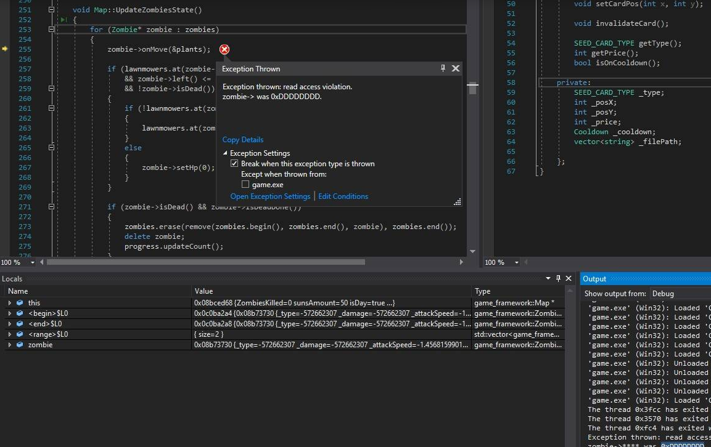

# PVZ_2023  

## By 方文昊 & 鄭琳玲  

### 2023-OOPL  
### LGF Version: [1.1.3](https://github.com/ntut-xuan/LeistungsstarkesGameFramework/releases/tag/v1.1.3)  

## Release v1.0.0

### Features & Progress:

1. Working main menu and transition screens.
2. Player can pick the 8 plants they want to use through the use of the plant picker.
3. Player can click on the suns falling from the sky by clicking on them.
    - The suns' position is determined by the game's PRNG (Pseudo Random Number Generator), which uses system clock.
4. Once a sun is clicked, the sun is added to the sun counter.
5. Zombies spawn in the right part of the screen and they walk to the left.
    - The lane they walk in is determined by the game's PRNG for now.

### Bugs:

1. The suns falling from the sky don't seem to despawn after a period of time. They can only be despawned when the player clicks on them.
2. Memory Leak: TBD.

## Release v2.0.0

1. Working main menu and transition screens.
2. Player can pick the 8 plants they want to use through the use of the plant picker.
3. Player can click on the suns falling from the sky by clicking on them.
    - The suns' position is determined by the game's PRNG (Pseudo Random Number Generator), which uses system clock.
4. Once a sun is clicked, the sun is added to the sun counter.
5. Zombies spawn in the right part of the screen and they walk to the left.
6. Plants can be planted on the lane and can attack the zombies.
    - Plants that be planted and used: `Peashooter`, `Snowpea`, `Cherrybomb`, `Wallnut`, `Repeaterpea`, `Threeshooterpea`, `Puffshroom`, `Scaredyshroom`, `Potatomine`, `Squash`, `Jalapeno`, `Iceshroom`.
    - Plants that be planted and can't be used: N/A.
    - Plants that is in WIP: `Hypnoshroom`, `Chomper`.
7. The plant picker cards has three modes:
    - The plant can't be planted since the accumulated sun isn't enough to plant the plants that the player wants.
    - The plant can be planted since the sun is accumulated and the cooldown has passed.
    - The plant can't be planted since the card needs to pass the cooldown time.
8. The plants will not put out bullets if there is no zombies detected in the lane.
9. The Sunflower can properly put out sun.
10. The plants and zombies can detect their presence; Hence the zombie will stop and start eating the plants away when they can detect the plants.
11. The game is playable on Fullscreen or minimized screen.
12. Plants Cancelation logic:
    - If the plants chosen are incorrect, then by `clicking right` then it will cancel the chosen plant.
    - If the plants chosen are planted on the square that has plant, then the logic will cancel the chosen plant.
13. Shovel logic: Removes the plants that has been planted on the map.
14. Landmower logic.
15. Progress Bar logic. (BETA)
16. Zombie Factory logic.
17. If the zombies are attacked by Snowpea, then the zombie animation will turn blue and move slower.
18. The zombies that can be generated are:
    - Normal Zombie
    - Conehead Zombie
    - Buckethead Zombie
    - Newspaper Zombie
    - Flag Zombie
19. In game menu logic.

### Bugs:

1. Memory Leak: TBD.
2. `Exception thrown: read access violation. ${ptr}-> was 0xDDDDDDDD`. Where ${ptr} can either be:
  - A `Sun` pointer inside the `vector` of Suns pointers in the logic of `Map`.
  - A `Zombie` pointer inside the `vector` of Zombie pointers in the logic of `Map`.
  - A `Bullet` pointer inside the `vector` of Bullet pointers in the logic of `Map`.
  - Example:
    - 
  - While we have 2 static template methods that we believe should mitigate this problem, these were last second additions and as such we are unsure if this problem persists.

## Release v3.0.0

1. Working main menu and transition screens.
2. Player can pick the 8 plants they want to use through the use of the plant picker.
3. Player can click on the suns falling from the sky by clicking on them.
    - The suns' position is determined by the game's PRNG (Pseudo Random Number Generator), which uses system clock.
4. Once a sun is clicked, the sun is added to the sun counter.
5. Zombies spawn in the right part of the screen and they walk to the left.
6. Plants can be planted on the lane and can attack the zombies.
    - Plants that be planted and used: `Peashooter`, `Snowpea`, `Cherrybomb`, `Wallnut`, `Repeaterpea`, `Threeshooterpea`, `Puffshroom`, `Scaredyshroom`, `Potatomine`, `Squash`, `Jalapeno`, `Iceshroom`.
    - Plants that be planted and can't be used: N/A.
    - Plants that is in WIP: `Hypnoshroom`, `Chomper`.
7. The plant picker cards has three modes:
    - The plant can't be planted since the accumulated sun isn't enough to plant the plants that the player wants.
    - The plant can be planted since the sun is accumulated and the cooldown has passed.
    - The plant can't be planted since the card needs to pass the cooldown time.
8. The plants will not put out bullets if there is no zombies detected in the lane.
9. The Sunflower can properly put out sun.
10. The plants and zombies can detect their presence; Hence the zombie will stop and start eating the plants away when they can detect the plants.
11. The game is playable on Fullscreen or minimized screen.
12. Plants Cancelation logic:
    - If the plants chosen are incorrect, then by `clicking right` then it will cancel the chosen plant.
    - If the plants chosen are planted on the square that has plant, then the logic will cancel the chosen plant.
13. Shovel logic: Removes the plants that has been planted on the map.
14. Landmower logic.
15. Progress Bar logic. (BETA)
16. Zombie Factory logic.
17. If the zombies are attacked by Snowpea, then the zombie animation will turn blue and move slower.
18. The zombies that can be generated are:
    - Normal Zombie
    - Conehead Zombie
    - Buckethead Zombie
    - Newspaper Zombie
    - Flag Zombie
19. In game menu logic.
20. About Us Page and button on main menu.
21. Night map logic.

## Work In Progress (Hopefully will be on Released on v3.0.0)

1. `Hypnoshroom`, `Chomper` plant logic.
<!-- 3. If the zombies are attacked by Hypno-Shroom, then the zombie animation will turn purple and walk to the map's right side. -->
4. Settings
  - SFX, Music
7. The initial screen explains the usage and tricks of buttons and mouse.

8. Report
  - Game Architecture Diagram (Example: https://drive.google.com/file/d/1mgaSa8rH2oY45Ke2r-ry9RKDD-02uBrF/view?usp=share_link)

### Bugs:

1. Memory Leak: TBD.
2. CAudio error.

#### Links  
[GitLab: TA files](http://140.124.183.78/gitlab/109000000/oopl2023s/-/tree/master)  
[GitHub: TA files](https://github.com/ntut-xuan/OOPL2023s)  
[Toggl](https://toggl.com/track)
[Drive](https://drive.google.com/drive/folders/1uUO3JXzw1orwGERktGzvPsLrcVoiPjgu?usp=sharing)
